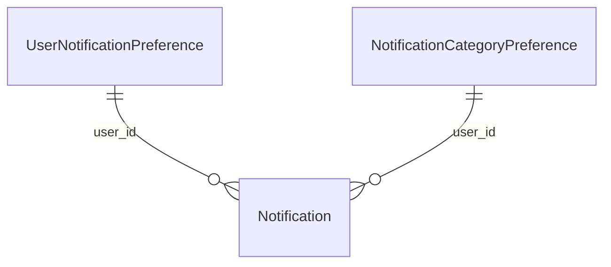

# ms-notifications — domain

Aggregates, value objects, invariants and schema. Endpoints: `API.md`. Messaging: `EVENTS.md`.
Shared VOs (`UserId`): parent `.ai/references/APP_STRUCTURE.md`.

## Aggregates

| Aggregate | Root entity | Owned entities | Repository | Key invariant |
|---|---|---|---|---|
| Notification | `Notification` | — | `NotificationRepository` | Record of user notification; stores type, title, message, channel, read status, and metadata JSONB |
| UserNotificationPreference | `UserNotificationPreference` | — | `UserNotificationPreferenceRepository` | Legacy user email preference facade (`monthlyEmailEnabled`) |
| NotificationCategoryPreference | `NotificationCategoryPreference` | — | `NotificationCategoryPreferenceRepository` | Per-category channel preferences (`inAppEnabled`, `emailEnabled`) for a user |

## Value objects

| VO | What it wraps | Validation it enforces |
|---|---|---|
| `NotificationId` | Long aggregate ID | Positive non-null ID |
| `CategorySummary` | Monthly spending breakdown per category | Non-null name and amount |

## Enumerations

| Enum | Values | What decides the value / Mapping |
|---|---|---|
| `NotificationType` | `PAYMENT_DUE`, `LOAN_REMINDER`, `INSTALLMENT_REMINDER`, `INVESTMENT_THRESHOLD`, `USER_REGISTERED`, `MONTHLY_SUMMARY`, `CARD_EXPIRING`, `LOW_BALANCE`, `TRANSFER_SENT`, `TRANSFER_RECEIVED`, `BALANCE_ADJUSTED`, `BUDGET_THRESHOLD_REACHED`, `IMPORT_STALE` | Set by inbound event type |
| `NotificationCategory` | `PAYMENT_DUE`, `PORTFOLIO_ALERTS`, `SUMMARY`, `ACCOUNT`, `SYSTEM`, `BUDGET`, `IMPORT_HEALTH` | Maps `NotificationType` to user preference category |
| `NotificationChannel` | `IN_APP`, `EMAIL`, `BOTH` | Resolved per notification category via `NotificationChannelResolver` |

## Category Mapping Table

| NotificationCategory | Covered NotificationTypes |
|---|---|
| `PAYMENT_DUE` | `PAYMENT_DUE`, `CARD_EXPIRING`, `LOAN_REMINDER`, `INSTALLMENT_REMINDER` |
| `PORTFOLIO_ALERTS` | `INVESTMENT_THRESHOLD` |
| `SUMMARY` | `MONTHLY_SUMMARY` |
| `ACCOUNT` | `LOW_BALANCE`, `BALANCE_ADJUSTED`, `TRANSFER_SENT`, `TRANSFER_RECEIVED` |
| `SYSTEM` | `USER_REGISTERED` |
| `BUDGET` | `BUDGET_THRESHOLD_REACHED` |
| `IMPORT_HEALTH` | `IMPORT_STALE` |

## Domain services

| Service | The single decision it owns |
|---|---|
| `NotificationService` | Persists notification and dispatches to SSE (`InAppNotificationSender`) and/or SMTP (`EmailSender`) based on channel |
| `NotificationChannelResolver` | Resolves target `NotificationChannel` by evaluating user's category preferences (defaults to `IN_APP` if missing) |

## ERD

## Schema `notifications`

| Migration | What it adds |
|---|---|
| V1 | `notifications` and `user_notification_preferences` tables |
| V2 | Performance indexes on `read = false` and `(user_id, created_at DESC)` |
| V3 | `processed_events` table for CloudEvent dedup (`event_id` PK) |
| V4 | `notification_delivery` table |
| V5 | `notification_preferences` per category & seeds `SUMMARY` from `user_notification_preferences` |
